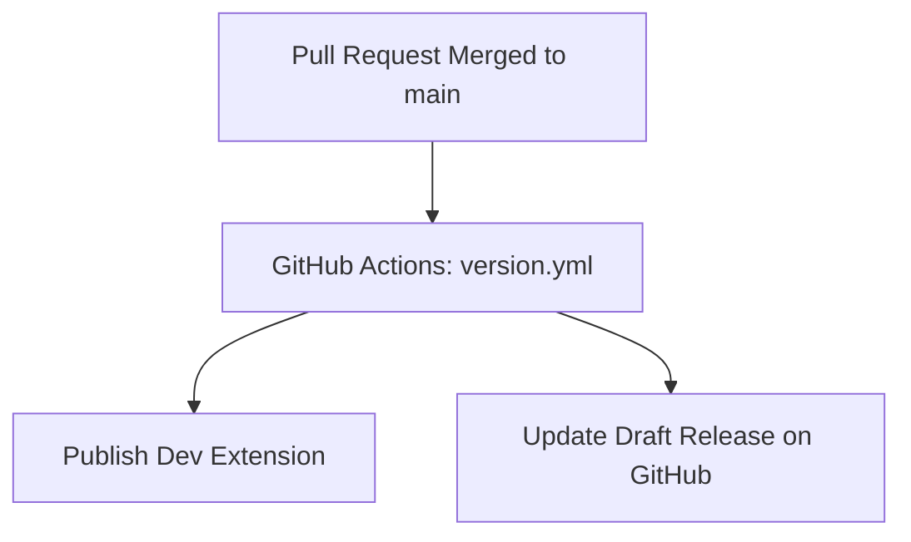
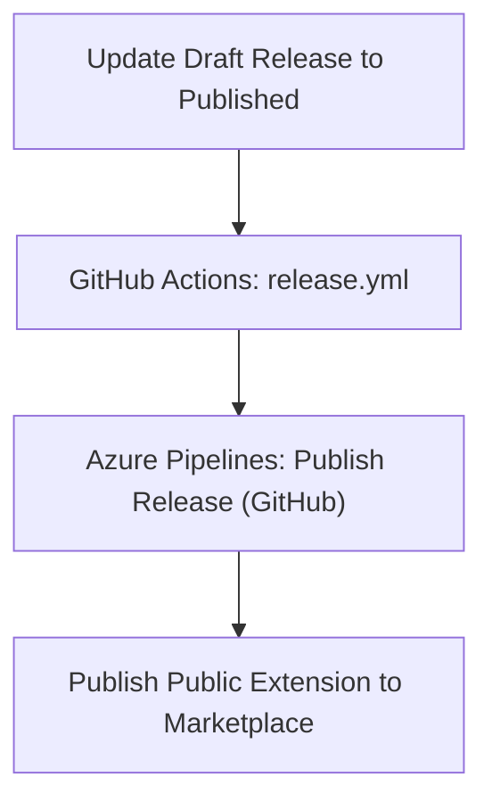

# Extension publishing

By default all merges to main are only published to the private **Release Dashboard (dev)** extension. A draft release is maintained on GitHub in <https://github.com/SixPivot/PivotProReleaseDashboard/releases>

When a new public version of the extension is ready to be published, edit the latest release draft on GitHub and click **Publish release**. This will first trigger the GitHub Actions [Release](.github/workflows/release.yml) workflow. This in turn triggers the Azure Pipelines [Publish Release (GitHub)](pipelines/release.yml), which will publish that version of the extension to the Azure DevOps marketplace.

## Technical notes

Two GitHub secrets are defined for use by the Release workflow:

- `AZURE_DEVOPS_PROJECT_URL` - the URL of the SixPivot Azure DevOps project that contains the **Publish Release (GitHub)** pipeline.
- `AZURE_DEVOPS_TOKEN` - an Azure DevOps Personal Access Token with **Build (Read and Execute)** permissions.
